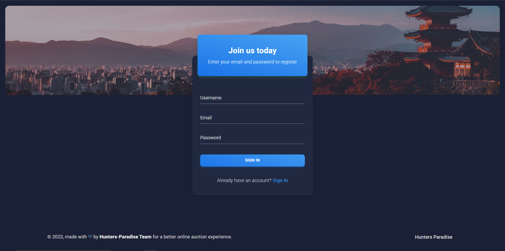
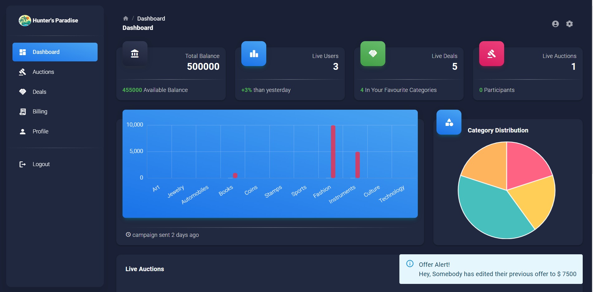
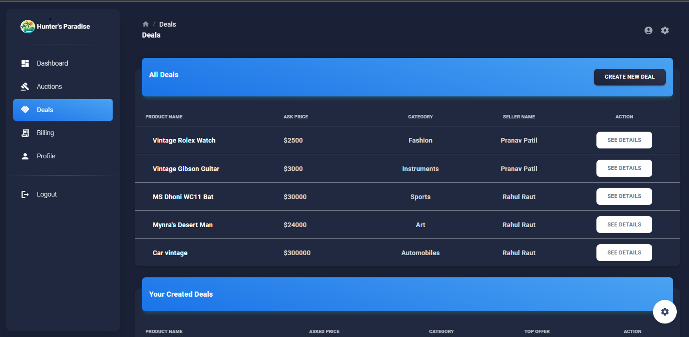
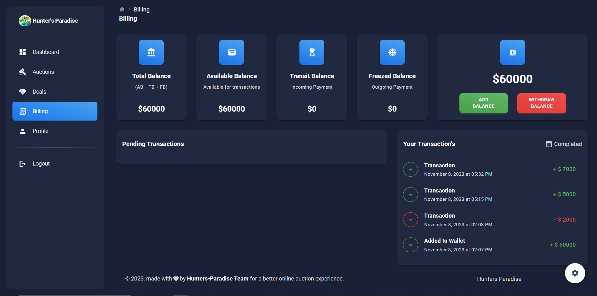
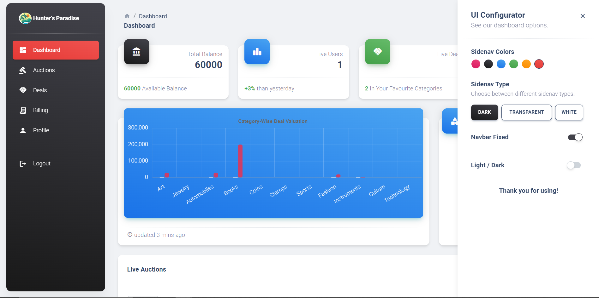

# Hunters Paradise

A Peer to peer rare commodities exchange place, where users can buy and sell rare products through auctions and deals. They will be notified in real-time about each update.

# Table of Contents

- [Installation](#installation)
- [Description](#description)
- [Images](#images)

## Installation

Follow these steps to get the project up and running.

### Prerequisites

- Node.js, libraries.
- Ably API Key
- Mongo DB
- React

### Step 1: Clone the repository

```bash
git clone https://github.com/Pranav915/HuntersParadise.git
cd HuntersParadise
```

### Step 2: Setup the env variables in .env file in server folder

Create .env file and populate with the envrionment variables, the list of environment variables is listed in the file environment variables in server.

###Step 3: Start the backend

```bash
cd server
npm install
npm run dev
```

###Step 4: Start the frontend

```bash
cd client
npm install
npm start
```

You must see the site UI live on localhost:3000, you can login and enter the dashboard.

## Description :

- **Real-Time Rare Commodity Exchange**: Hunter's Paradise is a dynamic online platform enabling real-time buying and selling
  of rare products through auctions and deals, enhancing user interaction.
- **Live Dashboard**: Implemented a dynamic real-time dashboard, allowing users to track ongoing auctions and deals
  in real-time.
- **Realtime Chat Integration**: Integrated a chat feature to facilitate communication among users, enhancing the
  collaborative experience on the platform.
- **Cutting-Edge Technologies**: Leveraged React, Redux, Ably, and Node.js to ensure seamless, instant updates, and
  notifications for users, providing a responsive and engaging user experience

## Images :

### Authentication



### Realtime Dashboard



### Live Auction Page


### All Deals Page



### Deal Details Page


### Billing Page



### Profile Page


### Change themes according to your needs


